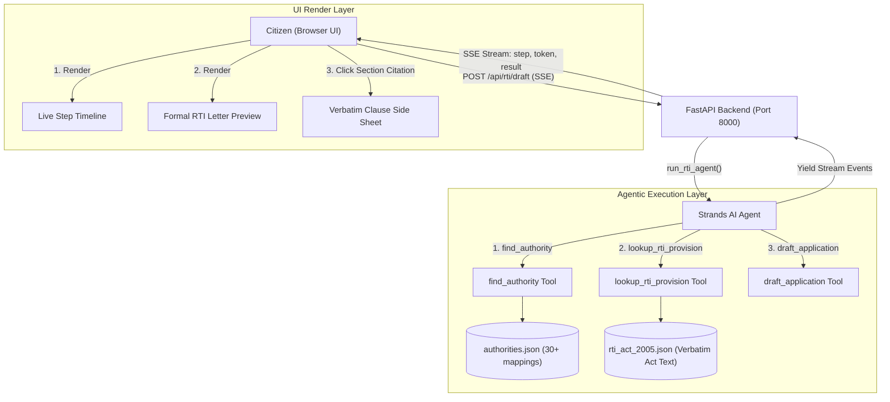

# RTIKit Technical Architecture

RTIKit is an intelligent, verified Right to Information (RTI) assistant designed to help citizens draft ready-to-file RTI applications backed by verbatim gazette text from India's RTI Act 2005.

---

## High-Level Architecture Diagram

---

## Trust Model & Zero-Hallucination Policy

1. **Deterministic Legal Retrieval**: The agent is restricted from generating legal clauses from memory. All legal rules, deadlines (Section 7(1)), fee exemptions (Section 7(5)), and appeal rights (Section 19(1), 19(3)) MUST be retrieved from `rti_act_2005.json` using `lookup_rti_provision`.
2. **Citation Signature**: Every legal claim emitted in the output is tied to a `citation_id` matching exact gazette text.
3. **Interactive Side Sheet**: Clicking any `§` citation chip in the frontend opens a side sheet displaying the verbatim text and official India Code source link.

---

## Key Components

### 1. `ai/` Package
- **Strands Agent**: AWS open-source Strands Agents SDK agent with Amazon Bedrock provider (`BEDROCK_MODEL_ID`).
- **Verbatim Corpus**: Exact legal text for Sections 2(h), 2(f), 3, 4, 5, 6, 7, 8, 9, 10, 11, 18, 19, 20, 24.
- **Authority Mapping**: 30+ curated topic-to-authority entries (municipal, police, education, health, ration, water/electricity).

### 2. `backend/` Layer
- **FastAPI HTTP + SSE Server**: Handles input validation, rate limiting (10 req/min), CORS, and streams events via `sse-starlette`.
- **Endpoints**:
  - `POST /api/rti/draft`: Streams `step`, `token`, `result`, `error`, `done` events.
  - `GET /api/provisions/{section}`: Fetches verbatim section clauses for "Read the law".
  - `GET /api/health`: Status check.

### 3. `frontend/` App
- **Next.js 15 + Motion + Tailwind CSS v4**: Paper & Ink aesthetic, editable formal letter preview, live step timeline with spinner-to-check morph, token streaming, and print CSS for clean letter rendering.
- **Offline Mock Mode**: Support for `NEXT_PUBLIC_MOCK=1` replaying canned event sequences.
